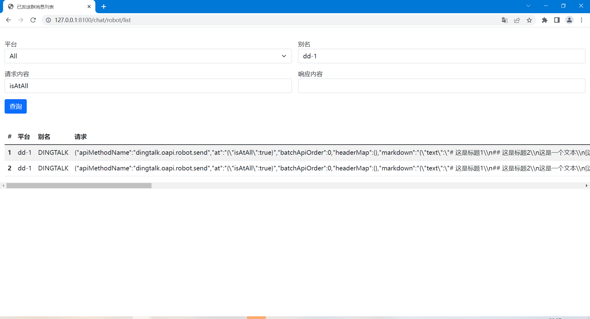

# chatbot-spring-boot-starter

[](https://jitpack.io/#com.gitee.wb04307201/chatbot-spring-boot-starter)

> 一个消息群发中间件  
> 只需要简单的配置和编码，即可将相同的消息发送到钉钉、飞书、企业微信聊天群以及邮箱  
> 统一消息维护方式，发送时会按照对应的平台类型自动进行转换

- [钉钉](https://open.dingtalk.com/document/group/custom-robot-access)
- [企业微信](https://developer.work.weixin.qq.com/document/path/91770)
- [飞书](https://open.feishu.cn/document/ukTMukTMukTM/ucTM5YjL3ETO24yNxkjN)

> 钉钉和飞书需要使用加签，配置时需要维护secret  
> 目前支持两种消息模式 **文本** 和 **markdown(飞书对应为富文本)**

## [代码示例](https://gitee.com/wb04307201/chatbot-demo)

## 第一步 增加 JitPack 仓库

```xml

<repositories>
    <repository>
        <id>jitpack.io</id>
        <url>https://jitpack.io</url>
    </repository>
</repositories>
```

## 第二步 引入jar

版本请到[jitpack](https://jitpack.io/#com.gitee.wb04307201/chatbot-spring-boot-starter)查看

```xml

<dependency>
    <groupId>com.gitee.wb04307201</groupId>
    <artifactId>chatbot-spring-boot-starter</artifactId>
    <version>版本</version>
</dependency>
```

## 第三步 在启动类上加上`@EnableChatbot`注解

```java

@EnableChatbot
@SpringBootApplication
public class ChatbotDemoApplication {

    public static void main(String[] args) {
        SpringApplication.run(SpringTestApplication.class, args);
    }

}
```

## 第四步 `application.yml`配置文件中添加以下相关配置，可以配置多个群

```yaml
chatbot:
  config:
    chatbot-info:
      - alias: dd-1
        chatbot-type: dingtalk
        # webhook地址 https://oapi.dingtalk.com/robot/send?access_token=xxxxxxxxxxxxxxxxx
        token: 为webhook地址中xxxxxxxxxxxxxxxxx部分
        secret: secret
      - alias: wx-1
        chatbot-type: weixin
        # webhook地址 https://qyapi.weixin.qq.com/cgi-bin/webhook/send?key=xxxxxxxxxxxxxxxxx
        token: 为webhook地址中xxxxxxxxxxxxxxxxx部分
      - alias: fs-1
        chatbot-type: feishu
        # webhook地址 https://open.feishu.cn/open-apis/bot/v2/hook/xxxxxxxxxxxxxxxxx
        token: 为webhook地址中xxxxxxxxxxxxxxxxx部分
        secret: secret
      - alias: mail-1
        chatbot-type: mail
        from: 发件邮箱
        to: 收件邮箱1,收件邮箱2
        host: stmp地址
        username: 用户名
        password: 密码
```

## 第五步 注入IChatbotService并调用发送信息

```java

@RestController
public class DemoController {

    @Autowired
    IChatbotService chatbotService;

    @GetMapping(value = "/chat/robot/test")
    public String send() {
        //发送到全部平台
        /*return chatbotService.send(
                RequestContent.buildMarkdown()
                        .title("测试群发")
                        .addLine(SubLine.title("这是标题1",1))
                        .addLine(SubLine.title("这是标题2",2))
                        .addLine(SubLine.text("这是一个文本"))
                        .addLine(SubLine.link("这是一个链接","https://gitee.com/wb04307201/chatbot-spring-boot-starter"))
                        .addLine(SubLine.quote("这是一个引用"))
                        .addLine(SubLine.bold("这是一个加粗"))
                        .atAll(true)
        ).toString();*/

        //发送到某类平台
        /*return chatbotService.send(
                RequestContent.buildMarkdown()
                        .addChatbotType(ChatbotType.DINGTALK)
                        .title("测试群发")
                        .addLine(SubLine.title("这是标题1",1))
                        .addLine(SubLine.title("这是标题2",2))
                        .addLine(SubLine.text("这是一个文本"))
                        .addLine(SubLine.link("这是一个链接","https://gitee.com/wb04307201/chatbot-spring-boot-starter"))
                        .addLine(SubLine.quote("这是一个引用"))
                        .addLine(SubLine.bold("这是一个加粗"))
                        .atAll(true)
        ).toString();*/

        //发送到某几个平台
        return chatbotService.send(
                RequestContent.buildMarkdown().addAlias("dd-1", "mail-1")
                        .title("测试群发")
                        .addLine(SubLine.title("这是标题1", 1))
                        .addLine(SubLine.title("这是标题2", 2))
                        .addLine(SubLine.text("这是一个文本"))
                        .addLine(SubLine.link("这是一个链接", "https://gitee.com/wb04307201/chatbot-spring-boot-starter"))
                        .addLine(SubLine.quote("这是一个引用"))
                        .addLine(SubLine.bold("这是一个加粗"))
                        .atAll(true)
        ).toString();
    }
}
```

目前支持的类型与转换格式对照如下表

| chatbot       | 钉钉  | 微信   | 飞书   | 邮件           |
|---------------|-----|------|------|--------------|
| SubLine.text  | 文字  | 文字   | text | <p>          |
| SubLine.title | 标题  | 标题   | text | <h1>~<h6>    |
| SubLine.link  | 链接  | 链接   | a    | <a>          |
| SubLine.quote | 引用  | 引用文字 | text | <blockquote> |
| SubLine.bold  | 加粗  | 加粗   | text | <strong>     |

## 其他1：内置界面

发送的消息可通过http://ip:端口/chat/robot/list进行查看  
注意：如配置了context-path需要在地址中对应添加  


## 其他2：动态增减平台信息

```java
//可以通过如下方法添加平台信息
chatbotService.addDingtalk
        chatbotService.addFeishu
        chatbotService.addWeixin
        chatbotService.addMail

//可以通过如下方法删除平台信息
        chatbotService.removeByAlias
```

## 其他3：实际使用中，可通过配置和实现接口方法将数据持久化到数据库中

继承IChatbotRecord并实现方法，例如

```java
public class H2ChatbotRecordImpl implements IChatbotRecord {

    private static final String HISTORY = "chat_robot_history";

    private static ConnectionPool connectionPool = new ConnectionPool(new ConnectionParam());

    @Override
    public ChatbotHistory save(ChatbotHistory chatbotHistory) {
        try {
            Connection conn = connectionPool.getConnection();
            if (!StringUtils.hasLength(chatbotHistory.getId())) {
                chatbotHistory.setId(UUID.randomUUID().toString());
                ExecuteSqlUtils.executeUpdate(conn, ModelSqlUtils.insertSql(HISTORY, chatbotHistory), new HashMap<>());
            } else {
                ExecuteSqlUtils.executeUpdate(conn, ModelSqlUtils.updateByIdSql(HISTORY, chatbotHistory), new HashMap<>());
            }
            connectionPool.returnConnection(conn);
        } catch (SQLException | InterruptedException e) {
            throw new RuntimeException(e);
        }
        return chatbotHistory;
    }

    @Override
    public List<ChatbotHistory> list(ChatbotHistory chatbotHistory) {
        try {
            Connection conn = connectionPool.getConnection();
            String sql = ModelSqlUtils.selectSql(HISTORY, new ChatbotHistory());

            List<String> condition = new ArrayList<>();
            if (StringUtils.hasLength(chatbotHistory.getType()))
                condition.add(" type = '" + chatbotHistory.getType() + "'");
            if (StringUtils.hasLength(chatbotHistory.getAlias()))
                condition.add(" alias like '%" + chatbotHistory.getAlias() + "%'");
            if (StringUtils.hasLength(chatbotHistory.getRequest()))
                condition.add(" request like '%" + chatbotHistory.getRequest() + "%'");
            if (StringUtils.hasLength(chatbotHistory.getResponse()))
                condition.add(" response like '%" + chatbotHistory.getResponse() + "%'");

            if (!condition.isEmpty()) sql = sql + " where " + String.join("and", condition);

            List<ChatbotHistory> res = ExecuteSqlUtils.executeQuery(conn, sql, new HashMap<>(), ChatbotHistory.class);
            connectionPool.returnConnection(conn);
            return res;
        } catch (SQLException | InterruptedException e) {
            throw new RuntimeException(e);
        }
    }

    @Override
    public void init() {
        try {
            Connection conn = connectionPool.getConnection();
            if (!ExecuteSqlUtils.isTableExists(conn, HISTORY, connectionPool.getDbType())) {
                ExecuteSqlUtils.executeUpdate(conn, ModelSqlUtils.createSql(HISTORY, new ChatbotHistory()), new HashMap<>());
            }
        } catch (SQLException | InterruptedException e) {
            throw new RuntimeException(e);
        }
    }
}
```

并添加配置指向类

```yaml
chatbot:
  config:
    chatbot-record: cn.wubo.chatbot.demo.H2ChatbotRecordImpl
```